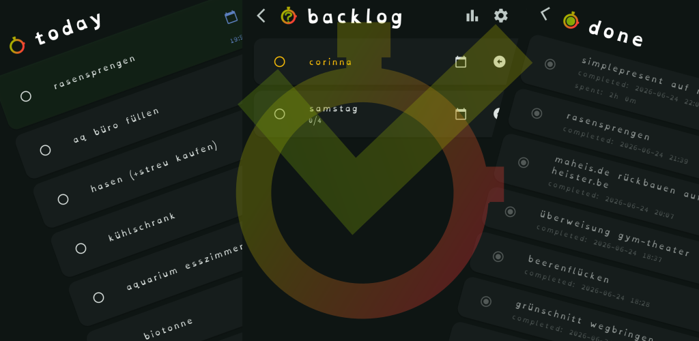

# simple present

A **simple** task management system focused on **present** tasks.

## What it does

SimplePresent helps you manage tasks across three lists: Today, Backlog, and Done. It supports important and in-progress flags, notes, subtasks, scheduled dates and times, and automatic sorting so current work stays in focus.
Perfect for people who like to work on multiple things at once and who can quickly get scattered across many different topics. It helps you keep an overview of your current items and stay focused on what matters now.

Protecting your privacy and keeping control over your data are core goals of SimplePresent. You retain full control: cloud synchronization is entirely optional and only transmits data to servers you explicitly choose and pair with. If you prefer maximum control, you may run your own sync server — the repository contains the tools and instructions needed to self-host. Choosing your own server or avoiding cloud sync entirely ensures your data stays under your control.

The app also includes a stopwatch, manual time tracking, reminders, swipe actions, cloud synchronization, and Android notifications.

## Key features

- Three task lists: Today, Backlog, and Done
- Important and in-progress task states
- Notes, subtasks, and scheduled date/time
- Stopwatch and manual time entry
- Automatic sorting and delayed reordering
- Cloud sync with pairing and device management
- Android notifications and desktop notifications
- Reminders and alarms

## Platforms

- Android (Google Play Store + APK)
- Desktop (Windows, Linux) via Flutter desktop
- Web (Flutter web) via browser  - Coming soon (?)

## Cloud Sync

Linux Server: The app can sync with a self-hosted server. The repository contains the tools and instructions needed to set up your own sync server.

## footnote

Developed with the kind support of Copilot
